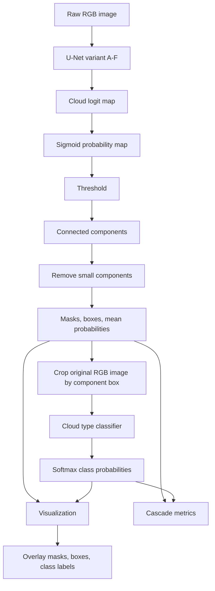

# Cloud Chaser Academic Pipeline

## Concept

Cloud Chaser is a two-stage computer vision research system for cloud identification in sky and outdoor imagery. The first stage compares six supervised U-Net variants trained on SWIMSEG/SkyImage masks. The second stage classifies RGB crops from segmented cloud components into one of seven meteorological cloud categories using a contrastive self-supervised ResNet50 classifier trained and fine-tuned on GCD.

Given an image \(I\), the system predicts cloud regions:

\[
\mathcal{P} = \{(M_i, B_i, c_i, s_i, p_i)\}_{i=1}^{N}
\]

where \(M_i\) is a cloud mask, \(B_i\) is a bounding box, \(c_i\) is the predicted cloud type, \(s_i\) is the U-Net component confidence, and \(p_i\) is classifier confidence.

## Pipeline Diagram



Important design constraint: the segmentation mask is not applied to classifier pixels. The mask is used for localization and visualization only. Classification receives the original RGB box crop:

```text
classifier input = original_image[y1:y2, x1:x2]
```

## Datasets

### Segmentation: SWIMSEG / SkyImage

SWIMSEG provides explicit binary cloud masks. The local preparation step discovers image-mask pairs, binarizes masks, creates a deterministic train/validation/test split, and writes a manifest consumed by the PyTorch U-Net dataset.

Configured split:

```text
train: 80%
val:   10%
test:  10%
```

### Classification: GCD

GCD supplies seven image-level cloud-type labels:

```text
1_cumulus
2_altocumulus
3_cirrus
4_clearsky
5_stratocumulus
6_cumulonimbus
7_mixed
```

The local loader supports both `train/<class>/*.jpg` and direct `<class>/*.jpg` layouts.

## Network Architectures

### U-Net Segmenter Family

The research compares six U-Net segmenters:

| ID | Name | Main Change |
|---|---|---|
| A | Current compact U-Net | `features=[32,64,128,256]`, transposed-conv decoder |
| B | Medium U-Net | `features=[64,128,256,512]`, higher-capacity standard U-Net |
| C | Dilated U-Net | replaces encoder DoubleConv blocks with dilated blocks |
| D | Dilated + ASPP U-Net | adds ASPP to encoder blocks for multi-scale context |
| E | Bicubic decoder U-Net | replaces transposed upsampling with bicubic interpolation |
| F | Improved U-Net | adds DS skip path and Im-CSAM attention |

All variants predict the same binary cloud mask:

```text
input:  3 x 224 x 224 normalized RGB image
output: 1 x 224 x 224 cloud logit map
activation at inference: sigmoid
```

Layer topology:

```text
Encoder:
  inc:   DoubleConv(3 -> 32)
  down1: MaxPool2d + DoubleConv(32 -> 64)
  down2: MaxPool2d + DoubleConv(64 -> 128)
  down3: MaxPool2d + DoubleConv(128 -> 256)
  down4: MaxPool2d + DoubleConv(256 -> 512)

Decoder:
  up1: ConvTranspose2d(512 -> 256) + concat skip 256 + DoubleConv(512 -> 256)
  up2: ConvTranspose2d(256 -> 128) + concat skip 128 + DoubleConv(256 -> 128)
  up3: ConvTranspose2d(128 -> 64)  + concat skip 64  + DoubleConv(128 -> 64)
  up4: ConvTranspose2d(64 -> 32)   + concat skip 32  + DoubleConv(64 -> 32)

Output:
Conv2d(32 -> 1, kernel_size=1)
```

For Baseline B and Models C-F, the same topology is scaled to:

```text
features = [64, 128, 256, 512]
bottleneck = DoubleConv(512 -> 1024)
decoder channels = 512 -> 256 -> 128 -> 64
output = Conv2d(64 -> 1, kernel_size=1)
```

`DoubleConv(a -> b)` is:

```text
Conv2d(a, b, kernel=3, padding=1, bias=false)
BatchNorm2d(b)
ReLU(inplace=true)
Conv2d(b, b, kernel=3, padding=1, bias=false)
BatchNorm2d(b)
ReLU(inplace=true)
```

Variant-specific modules:

```text
Baseline A compact:
  encoder block: DoubleConv
  decoder upsampling: ConvTranspose2d(kernel=2, stride=2)
  skip fusion: direct concatenation

Baseline B medium:
  encoder block: DoubleConv
  channels: [64, 128, 256, 512]
  decoder upsampling: ConvTranspose2d(kernel=2, stride=2)
  skip fusion: direct concatenation

Model C dilated:
  encoder block: DilatedConv(dilation=2) -> DilatedConv(dilation=2)
  decoder upsampling: ConvTranspose2d(kernel=2, stride=2)
  purpose: larger receptive field without extra pooling

Model D dilated + ASPP:
  encoder block: DilatedConv(dilation=2) -> ASPP -> DilatedConv(dilation=2)
  ASPP branches: Conv3x3 dilation 1, 3, 5 plus Conv1x1
  ASPP projection: Conv1x1(4C -> C) + BatchNorm + ReLU
  purpose: multi-scale cloud context

Model E bicubic decoder:
  encoder block: DilatedConv -> ASPP -> DilatedConv
  decoder upsampling: bicubic resize x2 -> Conv1x1 -> BatchNorm -> ReLU
  purpose: cleaner upsampling than learned transposed convolution

Model F full improved:
  encoder block: DilatedConv -> ASPP -> DilatedConv
  decoder upsampling: bicubic resize x2 -> Conv1x1 -> BatchNorm -> ReLU
  skip path: DSResidualPath -> ImprovedCSAM
  DSResidualPath: two depthwise-separable conv blocks with residual addition
  Channel attention: global average/max pooling -> Conv1x1(C -> max(C/8,4)) -> ReLU -> Conv1x1 -> sigmoid
  Spatial attention: depthwise-separable conv -> Conv1x1(C -> 1) -> sigmoid
```

Optimization configuration:

```yaml
epochs: 60
batch_size: 8
optimizer: AdamW
learning_rate: 0.0003
weight_decay: 0.00001
loss: BCEWithLogitsLoss + soft Dice loss
mixed precision: true when CUDA is available
checkpoint selection: best validation mIoU
```

Inference post-processing:

```text
probability = sigmoid(logits)
binary mask = probability >= 0.45
connected components with 8-connectivity
remove components with area < 256 pixels
box = component bounding rectangle
confidence = mean probability inside component
```

### Cloud-Type Classifier With CSSL

The classifier follows the attached contrastive self-supervised learning paper. A ResNet50 encoder is pretrained using a MoCo-style contrastive objective and then fine-tuned with a supervised fully connected head.

Default configuration:

```yaml
backbone: resnet50
num_classes: 7
input size: 224 x 224
dropout: 0.2
pretraining: ImageNet
CSSL projection dimension: 128
CSSL queue size: 4096
CSSL temperature: 0.5
CSSL momentum encoder coefficient: 0.999
```

Forward path:

```text
RGB crop
  -> ImageNet normalization
  -> CNN encoder
  -> feature vector
  -> Dropout(p=0.2)
  -> Linear(features_dim -> 7)
  -> logits
  -> softmax at inference
```

Supported encoders:

| Backbone | Feature Dimension | Head | Approx. Parameters | Pretrained Weights |
|---|---:|---|---:|---|
| ResNet50 | 2048 | `Dropout(0.2) -> Linear(2048, 7)` | 23.52M | `ResNet50_Weights.IMAGENET1K_V2` |
| EfficientNet-B0 | 1280 | `Dropout(0.2) -> Linear(1280, 7)` | 4.02M | `EfficientNet_B0_Weights.IMAGENET1K_V1` |
| DenseNet121 | 1024 | `Dropout(0.2) -> Linear(1024, 7)` | 6.96M | `DenseNet121_Weights.IMAGENET1K_V1` |

Fine-tuning configuration:

```yaml
epochs: 200
batch_size: 16
optimizer: SGD
learning_rate: 0.01
momentum: 0.9
weight_decay: 0.0001
loss: CrossEntropyLoss
mixed precision: true
freeze_backbone_epochs: 2
checkpoint selection: best validation macro F1
```

CSSL pretraining configuration:

```yaml
optimizer: SGD
learning_rate: 0.03
weight_decay: 0.0001
batch_size: 64
epochs: 200
loss: InfoNCE
projection_dim: 128
queue_size: 4096
temperature: 0.5
momentum: 0.999
```

## Training And Checkpointing

All trainable modules use checkpoint continuation:

```text
last.pt -> best.pt -> start from initialization/pretrained weights
```

U-Net, CSSL, and classifier checkpoints store:

```text
epoch
model state_dict
optimizer state_dict
validation metrics
architecture metadata
best metric so far
```

## Inference Cascade

1. Read the image with OpenCV.
2. Run U-Net segmentation.
3. Threshold the cloud probability map.
4. Convert connected components into masks and boxes.
5. Crop the original RGB image by each component box.
6. Run the classifier on RGB crops.
7. Overlay masks, boxes, class labels, and probabilities.

## Metrics

### SWIMSEG U-Net Metrics

```text
mIoU
Dice score
BCE + Dice validation loss
```

### GCD Classification Metrics

```text
Top-1 accuracy
Macro F1
Cross-entropy loss
```

### GCD Cascade Metrics

GCD has image-level labels but no masks, so final pipeline quality is measured using image-level cascade metrics:

```text
segmentation gate accuracy
classifier accuracy given detection
end-to-end cascade accuracy
```

Segmentation-gate correctness on GCD is defined as:

```text
non-clearsky class -> should produce at least one U-Net cloud component
clearsky class     -> should produce no U-Net cloud component
```

Classification correctness is measured only when a cloud component exists.
