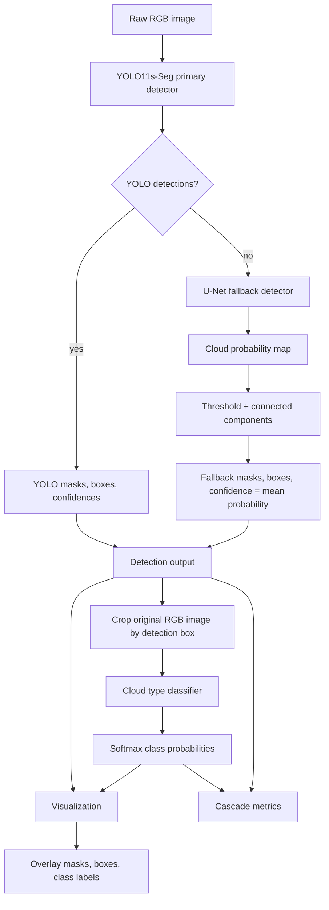

# Cloud Chaser Academic Pipeline

## Concept

Cloud Chaser is a hybrid two-stage computer vision system for cloud identification in sky and outdoor imagery. The first stage detects cloud regions using a YOLO-Seg primary detector and a U-Net fallback detector. The second stage classifies the detected RGB crop into one of seven meteorological cloud categories using a CNN trained on GCD.

Given an image \(I\), the system predicts cloud regions:

\[
\mathcal{P} = \{(M_i, B_i, c_i, s_i, p_i)\}_{i=1}^{N}
\]

where \(M_i\) is a cloud mask, \(B_i\) is a bounding box, \(c_i\) is the predicted cloud type, \(s_i\) is detector confidence, and \(p_i\) is classifier confidence.

## Pipeline Diagram



Important design constraint: the detector mask is not applied to classifier pixels. The mask is used for detection and visualization only. Classification receives the original RGB box crop:

```text
classifier input = original_image[y1:y2, x1:x2]
```

## Datasets

### Segmentation: SWIMSEG / SkyImage

SWIMSEG provides explicit binary cloud masks. The converter discovers image-mask pairs, binarizes masks, extracts connected components, converts components to YOLO polygons, and writes a one-class cloud segmentation dataset.

The same binary masks are used to train the U-Net fallback detector directly as semantic segmentation.

Configured split:

```text
train: 80%
val:   10%
test:  10%
```

### Classification: GCD

GCD supplies seven image-level cloud-type labels:

```text
1_cumulus
2_altocumulus
3_cirrus
4_clearsky
5_stratocumulus
6_cumulonimbus
7_mixed
```

The local loader supports both `train/<class>/*.jpg` and direct `<class>/*.jpg` layouts. GCD is treated as supervised classification data, not as an unlabeled pretraining substitute.

## Network Architectures

### YOLO-Seg Primary Detector

The primary detector is an Ultralytics YOLO segmentation model:

```text
model: yolo11s-seg.pt
task: instance segmentation
classes: 1
class name: cloud
input size: 640 x 640
```

YOLO-Seg architecture summary from the training logs:

```text
YOLO11s-Seg fused model
layers: 114
parameters: 10,067,203
GFLOPs: 32.8
```

Functional decomposition:

```text
Input image
  -> convolutional backbone
  -> multi-scale feature pyramid / neck
  -> detection head for boxes + objectness
  -> mask prototype branch
  -> mask coefficients per detection
  -> instance masks and boxes
```

Training target:

```text
SWIMSEG binary masks -> connected components -> YOLO polygon labels
```

Optimization configuration:

```yaml
epochs: 120
imgsz: 640
batch: 8
patience: 35
lr0: 0.01
weight_decay: 0.0005
amp: true
optimizer: Ultralytics default optimizer/scheduler
losses: Ultralytics segmentation objective
       box loss + classification/objectness loss + DFL + mask/segmentation loss
```

Inference settings:

```yaml
confidence threshold: 0.25
NMS IoU threshold: 0.60
half precision: true when CUDA is available
```

Output:

```text
M_i: instance mask
B_i: bounding box
s_i: detector confidence
```

### U-Net Fallback Detector

The fallback detector is a compact binary U-Net trained on SWIMSEG masks. It is used when YOLO returns no cloud detections.

Input/output:

```text
input:  3 x 224 x 224 normalized RGB image
output: 1 x 224 x 224 cloud logit map
activation at inference: sigmoid
```

Layer topology:

```text
Encoder:
  inc:   DoubleConv(3 -> 32)
  down1: MaxPool2d + DoubleConv(32 -> 64)
  down2: MaxPool2d + DoubleConv(64 -> 128)
  down3: MaxPool2d + DoubleConv(128 -> 256)
  down4: MaxPool2d + DoubleConv(256 -> 512)

Decoder:
  up1: ConvTranspose2d(512 -> 256) + concat skip 256 + DoubleConv(512 -> 256)
  up2: ConvTranspose2d(256 -> 128) + concat skip 128 + DoubleConv(256 -> 128)
  up3: ConvTranspose2d(128 -> 64)  + concat skip 64  + DoubleConv(128 -> 64)
  up4: ConvTranspose2d(64 -> 32)   + concat skip 32  + DoubleConv(64 -> 32)

Output:
  Conv2d(32 -> 1, kernel_size=1)
```

Model size:

```text
base channels: 32
trainable parameters: 7,763,041
```

`DoubleConv(a -> b)` is:

```text
Conv2d(a, b, kernel=3, padding=1, bias=false)
BatchNorm2d(b)
ReLU(inplace=true)
Conv2d(b, b, kernel=3, padding=1, bias=false)
BatchNorm2d(b)
ReLU(inplace=true)
```

Channel schedule:

```text
32 -> 64 -> 128 -> 256 -> 512 -> 256 -> 128 -> 64 -> 32 -> 1
```

Optimization configuration:

```yaml
epochs: 60
batch_size: 8
optimizer: AdamW
learning_rate: 0.0003
weight_decay: 0.00001
loss: BCEWithLogitsLoss + soft Dice loss
mixed precision: true when CUDA is available
checkpoint selection: best validation mIoU
```

U-Net inference post-processing:

```text
probability = sigmoid(logits)
binary mask = probability >= 0.45
connected components with 8-connectivity
remove components with area < 256 pixels
box = component bounding rectangle
confidence = mean probability inside component
```

### Cloud-Type Classifier

The classifier is a CNN encoder plus a small classification head.

Default configuration:

```yaml
backbone: resnet50
num_classes: 7
input size: 224 x 224
dropout: 0.2
pretraining: ImageNet
```

Forward path:

```text
RGB crop
  -> ImageNet normalization
  -> CNN encoder
  -> feature vector
  -> Dropout(p=0.2)
  -> Linear(features_dim -> 7)
  -> logits
  -> softmax at inference
```

Supported encoders:

| Backbone | Feature Dimension | Head | Approx. Parameters | Pretrained Weights |
|---|---:|---|---:|---|
| ResNet50 | 2048 | `Dropout(0.2) -> Linear(2048, 7)` | 23.52M | `ResNet50_Weights.IMAGENET1K_V2` |
| EfficientNet-B0 | 1280 | `Dropout(0.2) -> Linear(1280, 7)` | 4.02M | `EfficientNet_B0_Weights.IMAGENET1K_V1` |
| DenseNet121 | 1024 | `Dropout(0.2) -> Linear(1024, 7)` | 6.96M | `DenseNet121_Weights.IMAGENET1K_V1` |

Default ResNet50 structure:

```text
Conv7x7 stem + max pool
Residual stage conv2_x
Residual stage conv3_x
Residual stage conv4_x
Residual stage conv5_x
Global average pooling
Identity replacement for original fc layer
Dropout(0.2)
Linear(2048 -> 7)
```

The classifier head has 14,343 trainable parameters for the default ResNet50 setup:

```text
Linear weights: 2048 x 7 = 14,336
Linear bias:    7
Total head:     14,343
```

Optimization configuration:

```yaml
epochs: 80
batch_size: 32
optimizer: AdamW
learning_rate: 0.0001
weight_decay: 0.0001
loss: CrossEntropyLoss
mixed precision: true
freeze_backbone_epochs: 2
checkpoint selection: best validation macro F1
```

Training augmentations:

```text
RandomResizedCrop(224, scale=0.65-1.0, ratio=0.85-1.2)
HorizontalFlip(p=0.50)
VerticalFlip(p=0.15)
RandomShadow(p=0.25)
GaussianBlur(p=0.20)
ColorJitter(p=0.35)
Normalize(ImageNet mean/std)
ToTensorV2
```

Evaluation transform:

```text
Resize(224, 224)
Normalize(ImageNet mean/std)
ToTensorV2
```

## Training And Checkpointing

All trainable modules use checkpoint continuation:

```text
last.pt -> best.pt -> start from initialization/pretrained weights
```

YOLO resumes through the Ultralytics resume path when `last.pt` exists. U-Net and classifier checkpoints store:

```text
epoch
model state_dict
optimizer state_dict
validation metrics
best metric so far
```

Checkpoint criteria:

```text
YOLO detector: Ultralytics best validation result
U-Net:         best validation mIoU
Classifier:   best validation macro F1
```

## Inference Cascade

The production inference cascade is:

1. Read the image with OpenCV.
2. Run YOLO-Seg.
3. If YOLO returns detections, keep YOLO masks and boxes.
4. If YOLO returns no detections and `detector.backend: hybrid`, run U-Net.
5. Convert U-Net probability maps to connected components if needed.
6. Crop the original RGB image by the chosen detection box.
7. Run the classifier on RGB crops.
8. Overlay detector masks, boxes, class labels, and probabilities.

The classifier input is intentionally not masked. This keeps inference aligned with GCD-style RGB image training and avoids introducing black-mask artifacts.

## Metrics

### SWIMSEG Detector Metrics

YOLO-Seg is evaluated with:

```text
box precision/recall
box mAP50
box mAP50-95
mask precision/recall
mask mAP50
mask mAP50-95
```

U-Net is evaluated with:

```text
mIoU
Dice score
BCE + Dice validation loss
```

### GCD Classification Metrics

Standalone classifier evaluation reports:

```text
Top-1 accuracy
Macro F1
Cross-entropy loss
```

### GCD Cascade Metrics

GCD has image-level labels but no masks, so final pipeline quality is measured using image-level cascade metrics:

```text
detector image accuracy
classifier accuracy given detection
end-to-end cascade accuracy
```

Detector correctness on GCD is defined as:

```text
non-clearsky class -> should produce at least one cloud detection
clearsky class     -> should produce no cloud detection
```

Classification correctness is measured only when a detection exists. End-to-end correctness requires both the detector gate and the class prediction to be correct.

## Current Bottleneck

Recent cascade validation showed that hybrid detection is relatively strong, while classification after detection is the bottleneck. The most important pipeline correction was removing mask-blackout from classifier inputs. Detection masks are now used only for localization and visualization, and the classifier receives normal RGB crops.
